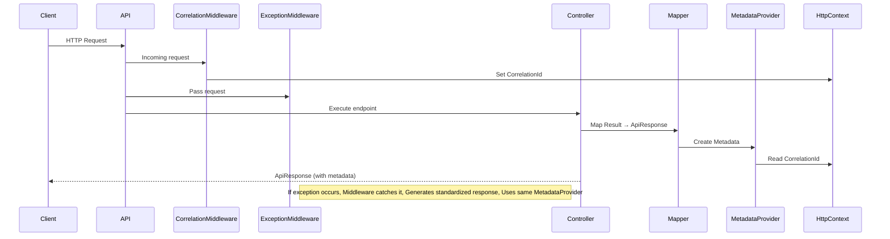
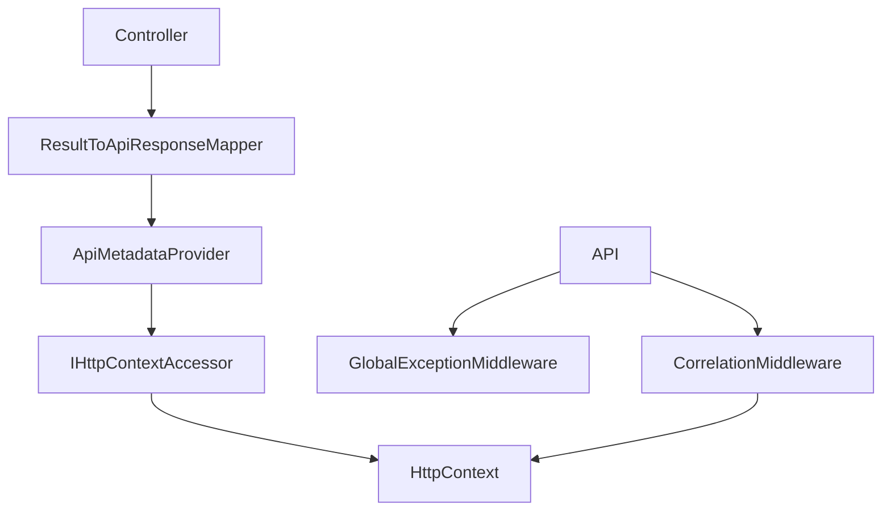
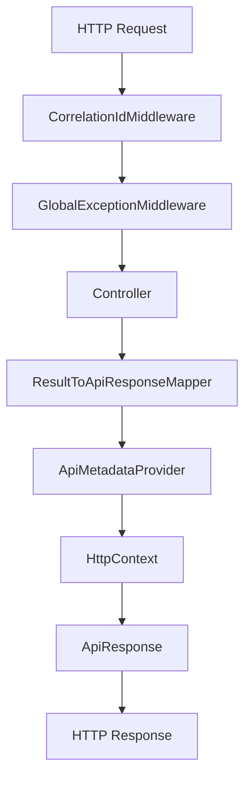

# Phase 0.4 — Integration Hardening

---

## 🔄 Sequence Diagram

```mermaid
sequenceDiagram
    participant Client
    participant API
    participant CorrelationMiddleware
    participant ExceptionMiddleware
    participant Controller
    participant Mapper
    participant MetadataProvider
    participant HttpContext

    Client->>API: HTTP Request

    API->>CorrelationMiddleware: Incoming request
    CorrelationMiddleware->>HttpContext: Set CorrelationId

    API->>ExceptionMiddleware: Pass request

    API->>Controller: Execute endpoint

    Controller->>Mapper: Map Result → ApiResponse
    Mapper->>MetadataProvider: Create Metadata
    MetadataProvider->>HttpContext: Read CorrelationId

    Controller-->>Client: ApiResponse (with metadata)

    Note right of ExceptionMiddleware: If exception occurs, Middleware catches it, Generates standardized response, Uses same MetadataProvider
```

```mermaid
graph TD
    API --> CorrelationMiddleware
    API --> GlobalExceptionMiddleware

    Controller --> ResultToApiResponseMapper
    ResultToApiResponseMapper --> ApiMetadataProvider

    ApiMetadataProvider --> IHttpContextAccessor
    IHttpContextAccessor --> HttpContext

    CorrelationMiddleware --> HttpContext
```

```mermaid
flowchart TD
    A[HTTP Request] --> B[CorrelationIdMiddleware]
    B --> C[GlobalExceptionMiddleware]
    C --> D[Controller]
    D --> E[ResultToApiResponseMapper]
    E --> F[ApiMetadataProvider]
    F --> G[HttpContext]
    G --> H[ApiResponse]
    H --> I[HTTP Response]
```
